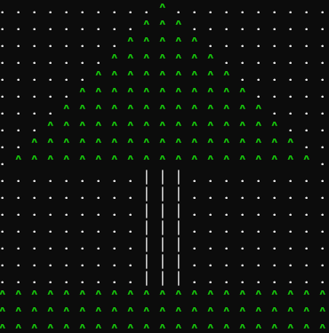
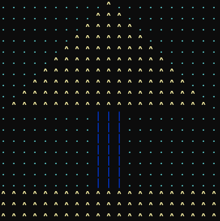
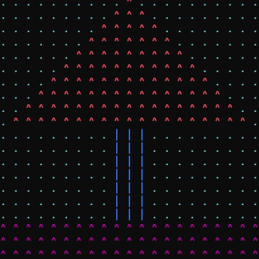

# 🌲 MDEgle – Console Fir Tree Generator

A simple C# console application that generates a customizable fir tree using loops and console colors.

The project focuses on practicing arrays, loops, conditional logic, input validation, and basic console rendering.

---

## 🧠 Overview

The application allows the user to generate a tree with custom settings:

- Tree size (height-based scaling)
- Crown color
- Trunk color
- Ground color
- Background color
- Optional random or default color selection

The tree is rendered directly in the console using characters and colored output.

---

## 🖼️ Output Examples

Different configurations produce different visual results:

  
  
  

---

## ✨ Features

- Customizable tree size
- Color selection from predefined list
- Default color fallback (press Enter)
- Console-based rendering with colors
- Input validation for robustness
- Random color option (if implemented)
- Clean separation of input and rendering logic

---

## ⚙️ How it works

1. User selects tree height
2. User selects colors (or uses defaults)
3. Program calculates tree structure using nested loops
4. Console output renders:
   - Crown (tree branches)
   - Trunk
   - Ground layer
   - Background filler

---

## 🛠️ Refactoring & Improvements

The project was refactored to improve readability, structure, and user experience:

- Refactored `Program.cs` to support user-selected colors for:
  - Tree crown
  - Trunk
  - Ground
  - Background
- Introduced helper methods:
  - `GetColorInput()` for validated color selection
  - `PrintWithColor()` for consistent colored output
- Simplified size input logic
- Removed unused array-based drawing logic
- Replaced redundant structures with direct rendering approach
- Improved input validation and default value handling
- Enhanced overall UX with clearer prompts and color feedback
- Added example output images for better visualization

---

## 🎯 Learning Goals

This project was created to practice:

- Nested loops and coordinate-based drawing
- Console color manipulation
- Input validation patterns
- Refactoring from prototype → clean structure
- Turning logic into reusable methods
- Basic “graphics-like” thinking in console applications

---

## 📌 Notes

This project serves as a personal learning milestone for working with console rendering and structured input handling in C#. It can be extended in the future with additional shapes or animation effects.

